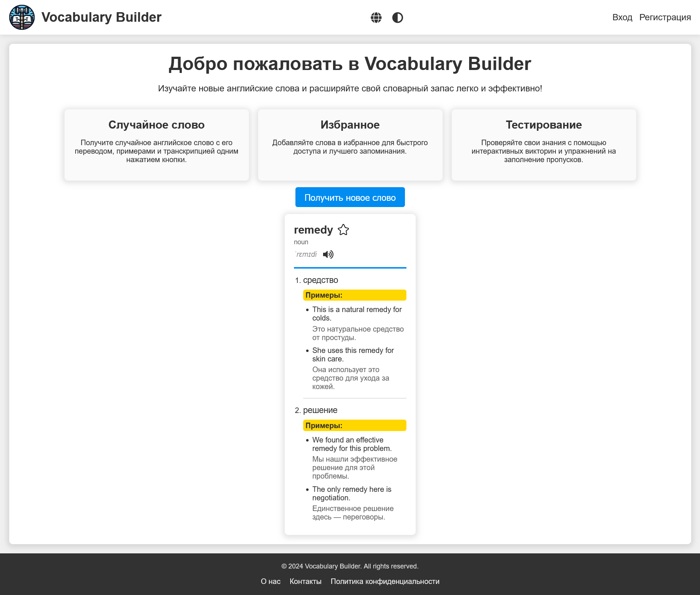

# Vocabulary Builder 🧠✨

**Vocabulary Builder** is a web application designed
to help you expand your English vocabulary
effortlessly.

## 📚 Key Features

-   **Random Word Generator:** Discover new words
    with their translations and usage examples.
-   **Favorite Words:** Save words that you want
    to revisit.
-   **Multilingual Support:** The application
    supports multiple languages, making it
    easier to learn from your native language.

## 🚀 Getting Started

**1. Clone the repository:**

```bash
git clone git@github.com:ilystsov/vocabulary-builder.git
```

**2. Run the application:**
Make sure Docker is installed and running, then use **make** to start the application:

```bash
make run
```

**3. Access the site:**
Open your browser and go to http://localhost:8000.

## 📸 Screenshots

Here’s a glimpse of what you’ll experience:


## 📖 Documentation

For detailed technical documentation, please visit the [Vocabulary Builder Documentation](https://vocabulary-builder.readthedocs.io/en/latest/index.html).

## 🛠️ Technologies Used

-   **FastAPI** for building the backend
-   **PostgreSQL** for database management
-   **Docker** for containerization
-   **SQLAlchemy** for ORM
-   **Alembic** for database migrations
-   **Jinja2** for templating
-   **Babel** for internationalization
