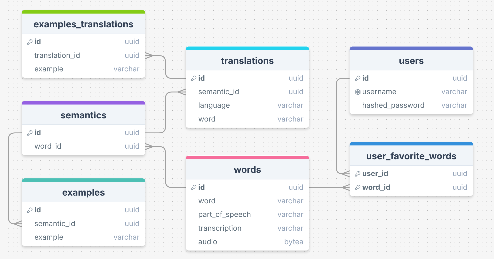

Database Schema and Models
==========================

This section describes the database schema and models used in the Vocabulary Builder application.

ER Diagram
----------

The following ER diagram provides a visual overview of the database schema:

SQLAlchemy Models
-----------------

The database models used in this project are defined using SQLAlchemy. Below is the documentation of these models:

.. automodule:: vocabulary_builder.db.models
   :members:
   :private-members:

CRUD Operations
---------------

The CRUD operations for interacting with the database are defined in the `crud.py` module. These operations provide an interface to create, read, update, and delete records from the database.

.. automodule:: vocabulary_builder.db.crud
   :members:
   :private-members:
