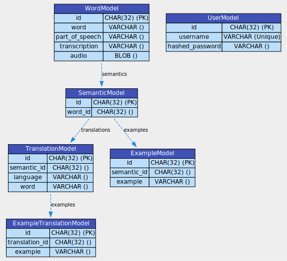

# Database ORM Models Documentation

This document provides a detailed description of the ORM models used in the database for the FastAPI web application designed to help users learn English words. Below are the descriptions and relationships for each of the five models used, along with the UserModel.

## WordModel

Represents an English word with its part of speech, transcription, and pronunciation audio.

-   **Table Name:** `words`
-   **Fields:**
    -   `id` (UUID): Primary key.
    -   `word` (str): The English word.
    -   `part_of_speech` (str): The part of speech of the word.
    -   `transcription` (str): The transcription of the word.
    -   `audio` (bytes): The pronunciation audio of the word (binary data).
    -   `semantics` (list of SemanticModel): List of semantic meanings of the word.

## SemanticModel

Represents a semantic meaning of an English word.

-   **Table Name:** `semantics`
-   **Fields:**
    -   `id` (UUID): Primary key.
    -   `word_id` (UUID): Foreign key to the associated word.
    -   `translations` (list of TranslationModel): List of translations for this semantic meaning.
    -   `examples` (list of ExampleModel): List of usage examples for this semantic meaning.

## ExampleModel

Represents a usage example of an English word in a specific semantic context.

-   **Table Name:** `examples`
-   **Fields:**
    -   `id` (UUID): Primary key.
    -   `semantic_id` (UUID): Foreign key to the associated semantic meaning.
    -   `example` (str): The example text.

## TranslationModel

Represents a translation of an English word's semantic meaning into another language.

-   **Table Name:** `translations`
-   **Fields:**
    -   `id` (UUID): Primary key.
    -   `semantic_id` (UUID): Foreign key to the associated semantic meaning.
    -   `language` (str): The target language of the translation.
    -   `word` (str): The translated word.
    -   `examples` (list of ExampleTranslationModel): List of translations for the usage examples in this semantic context.

## ExampleTranslationModel

Represents a translation of a usage example of an English word into another language.

-   **Table Name:** `examples_translations`
-   **Fields:**
    -   `id` (UUID): Primary key.
    -   `translation_id` (UUID): Foreign key to the associated translation.
    -   `example` (str): The translated example text.

## UserModel

Represents a user in the system.

-   **Table Name:** `users`
-   **Fields:**
    -   `id` (UUID): Primary key.
    -   `username` (str): The username of the user.
    -   `hashed_password` (str): The hashed password of the user.

## ORM Diagram

This diagram represents the ORM models used in our FastAPI application.

